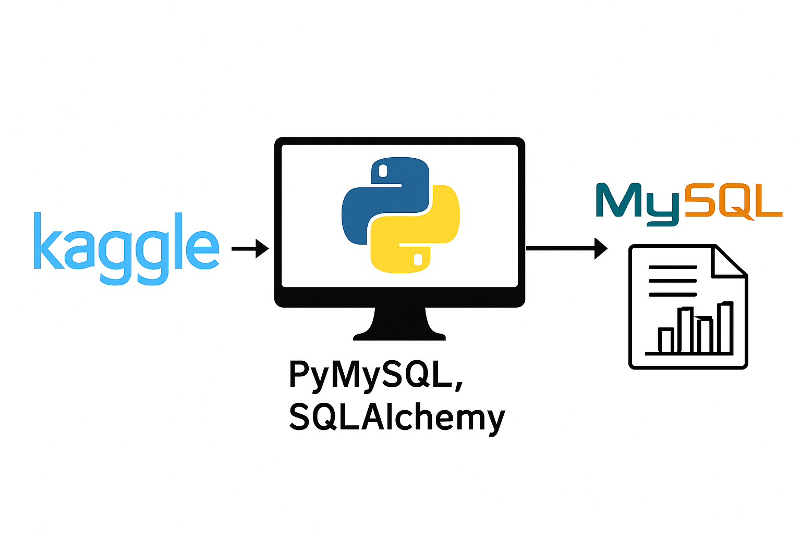

# Walmart-Sales-EDA: Discovering Business Insights from Sales Data

**An end-to-end sales data analysis project using Python and SQL to clean, explore, and understand sales data, uncover useful business insights, answer important questions, and create simple data pipelines for easier reporting and better decision-making.**

## Project Overview



## Project Steps

### 1. Set Up the Environment
   - **Tools Used**: Visual Studio Code (VS Code), Python, SQL (MySQL and PostgreSQL)
   - **Goal**: Create a structured workspace within VS Code and organize project folders for smooth development and data handling.

### 2. Set Up Kaggle API
   - **API Setup**: Obtain your Kaggle API token from [Kaggle](https://www.kaggle.com/) by navigating to your profile settings and downloading the JSON file.
   - **Configure Kaggle**: 
      - Place the downloaded `kaggle.json` file in your local `.kaggle` folder.
      - Use the command `kaggle datasets download -d <dataset-path>` to pull datasets directly into your project.

### 3. Download Walmart Sales Data
   - **Data Source**: Use the Kaggle API to download the Walmart sales datasets from Kaggle.
   - **Dataset Link**: [Walmart Sales Dataset](https://www.kaggle.com/najir0123/walmart-10k-sales-datasets)
   - **Storage**: Save the data in the `data/` folder for easy reference and access.

### 4. Install Required Libraries and Load Data
   - **Libraries**: Install necessary Python libraries using:
     ```bash
     pip install pandas numpy sqlalchemy 
     ```
   - **Loading Data**: Read the data into a Pandas DataFrame for initial analysis and transformations.

### 5. Explore the Data
   - **Goal**: Conduct an initial data exploration to understand data distribution, check column names, types, and identify potential issues.
   - **Analysis**: Use functions like `.info()`, `.describe()`, and `.head()` to get a quick overview of the data structure and statistics.

### 6. Data Cleaning
   - **Remove Duplicates**: Identify and remove duplicate entries to avoid skewed results.
   - **Handle Missing Values**: Drop rows or columns with missing values if they are insignificant; fill values where essential.
   - **Fix Data Types**: Ensure all columns have consistent data types (e.g., dates as `datetime`, prices as `float`).
   - **Currency Formatting**: Use `.replace()` to handle and format currency values for analysis.
   - **Validation**: Check for any remaining inconsistencies and verify the cleaned data.

### 7. Feature Engineering
   - **Create New Columns**: Calculate the `Total Amount` for each transaction by multiplying `unit_price` by `quantity` and adding this as a new column.
   - **Enhance Dataset**: Adding this calculated field will streamline further SQL analysis and aggregation tasks.

### 8. Load Data into MySQL and PostgreSQL
   - **Set Up Connections**: Connect to MySQL and PostgreSQL using `sqlalchemy` and load the cleaned data into each database.
   - **Table Creation**: Set up tables in both MySQL and PostgreSQL using Python SQLAlchemy to automate table creation and data insertion.
   - **Verification**: Run initial SQL queries to confirm that the data has been loaded accurately.

### 9. SQL Analysis: Complex Queries and Business Problem Solving
   - **Business Problem-Solving**: Write and execute complex SQL queries to answer critical business questions, such as:
     - Revenue trends across branches and categories.
     - Identifying best-selling product categories.
     - Sales performance by time, city, and payment method.
     - Analyzing peak sales periods and customer buying patterns.
     - Profit margin analysis by branch and category.
   - **Documentation**: Keep clear notes of each query's objective, approach, and results.

### 10. Project Publishing and Documentation
   - **Documentation**: Maintain well-structured documentation of the entire process in Markdown or a Jupyter Notebook.
   - **Project Publishing**: Publish the completed project on GitHub or any other version control platform, including:
     - The `README.md` file (this document).
     - Jupyter Notebooks (if applicable).
     - SQL query scripts.
     - Data files (if possible) or steps to access them.

---

## Requirements

- **Python 3.8+**
- **SQL Databases**: MySQL, PostgreSQL
- **Python Libraries**:
  - `pandas`, `numpy`, `sqlalchemy`
- **Kaggle API Key** (for data downloading)


